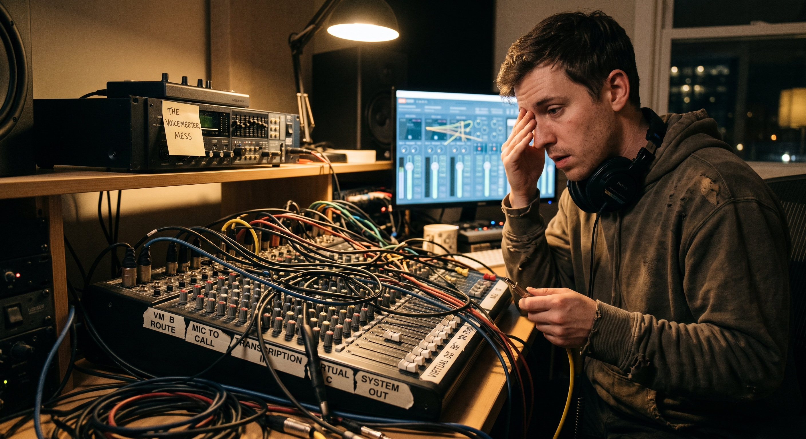

# 🪑 Agent In The Armchair

**Real-time streaming Voice-to-Text + AI Agent for any call app** — Signal, Teams, Zoom, Meet. Invisible. Local. Free.

Agent In The Armchair sits in your calls, listens, transcribes with speaker labels, and speaks when directly addressed — in real time, on your hardware, with zero per-hour costs. No bot joins the call. The app doesn't know it's there.

Part of [The Pack](https://github.com/Roughn3ck/ExecutiveMind) at [Executive Mind](https://executivemind.io).

---

## Architecture (v2 — Streaming)

```
Teams Meeting Audio (speaker output) + Local Mic
       ↓
ffmpeg amix (mixes meeting audio + mic into one 16kHz mono stream)
       ↓
B:\armchair_audio.raw (continuous PCM stream)
       ↓
WSL: armchair_live.py (streaming pipeline)
       ↓
Silero VAD — detects speech, skips silence (nearly free on GPU)
       ↓
faster-whisper streaming — incremental transcription with word timestamps
       ↓
pyannote-audio (16s rolling buffer, every 10s) — per-segment speaker labels
       ↓
Dashboard (http://localhost:8765) with live labeled transcript
       ↓
[If Talk mode + agent name detected in speech]
       ↓
LLM gate (Ollama): "Am I being directly addressed?"
       ↓
Yes → TTS engine (Piper / Kokoro / Chatterbox voice cloning) → WAV → PowerShell → CABLE-A → meeting hears agent
No  → [SILENCE] — agent stays quiet
```

### Key Design Decisions

- **No bot joins the meeting.** Hardware audio capture via VB-Cable. Teams can't block it.
- **No third-party APIs.** Runs entirely on local hardware. Zero per-hour cost.
- **VAD-driven, not time-driven.** Silero VAD detects speech, only sends speech to Whisper. Silence is skipped.
- **Per-segment speaker matching.** Whisper word timestamps matched to pyannote speaker segments. Handles mid-utterance speaker switches.
- **LLM gate for direct address.** The LLM decides if it's being addressed vs mentioned. No keyword matching.
- **Three TTS engines, swappable mid-call.** Piper (fast, ~1s, built-in voices), Kokoro (premium quality, ~1.6s), Chatterbox (zero-shot voice cloning from a reference WAV — the agent can speak in *any* voice you give it). Engines run as persistent workers in isolated venvs; a dashboard ⚡Activate button pre-warms an engine so switching is instant. Worker pool keeps used engines loaded — switch back with zero latency.
- **Session management.** Each session archived to its own folder with transcript, audio, and speaker data.

## What's Here

| File | Purpose |
|------|---------|
| `armchair_live.py` | Main streaming pipeline (VTT + diarization + LLM + TTS) |
| `dashboard_server.py` | HTTP server for live dashboard + API |
| `dashboard.html` | Web dashboard with speaker naming, agent config, TTS engine select, mode toggle |
| `tts_workers/` | Persistent TTS engine workers (kokoro, chatterbox) — isolated venvs, JSON-over-stdin |
| `stream_to_file.bat` | Windows ffmpeg audio capture (meeting audio + mic) |
| `start_armchair.bat` | One-click launcher (audio + dashboard + pipeline + browser) |
| `setup_audio.bat` | Audio routing setup guide (three-listener matrix) |
| `voices/` | Sample voice files (British + American) with README |
| `requirements.txt` | Python dependencies |
| `STATUS.md` | Full architecture history and component docs |

## Features

### Streaming VTT
- Silero VAD detects speech, skips silence
- faster-whisper with incremental transcription (word timestamps)
- ~0.3s transcription latency

### Speaker Diarization
- pyannote-audio on 16s rolling buffer (runs every 10s)
- Per-segment speaker labels matched to Whisper word timestamps
- Handles mid-utterance speaker switches
- Dashboard speaker naming: auto-populates detected speakers, type names, applies retroactively
- Label button for explicit save

### Talk / Listen Mode
- 🔇 Listen: Pure VTT with speaker labels
- 🎤 Talk: VTT + LLM + TTS — agent responds when directly addressed
- LLM decides: direct address vs mention (returns [SILENCE] for mentions)
- Agent name configurable in dashboard

### TTS — Three Engines
- **Piper** — built-in voices (Alan default), ~1s generation, instant voice swaps
- **Kokoro** — premium quality voices (~1.6s warm), own venv (`~/.local/share/kokoro-venv`)
- **Chatterbox** — zero-shot voice cloning from a reference WAV (e.g. Muska's voice), own venv (`~/.local/share/chatterbox-venv`), ~2.4s warm
- Engine selectable from dashboard; ⚡Activate button pre-warms an engine in the background
- Worker pool keeps engines loaded — switching back to a used engine is instant
- Hot-swap mid-call: engine, Piper voice, and reference WAV all switch on the next utterance

### Agent Memory
- Custom memory directory field on dashboard — any folder of .md/.txt files loaded into the system prompt at startup
- Windows-style paths (`B:\...`) auto-normalized to WSL (`/mnt/b/...`)
- Point it at an agent's workspace and it calls with that agent's brain, not just its voice

### Session Management
- Each session creates `B:\armchair_tmp\session_logs\YYYY-MM-DD_HHMMSS\`
- On shutdown: saves transcript.txt, speaker_names.json, detected_speakers.json, audio.raw
- Clean start each time — no bleed between sessions

### One-Click Launcher
- `start_armchair.bat` — double-click to start everything
- Opens audio capture, dashboard, browser, and pipeline
- Ctrl+C stops and saves session

## Setup

### Prerequisites

**Windows (Python 3.12+):**
```powershell
cd C:\path\to\Armchair\Armchair
.\install.bat
```
`install.bat` creates all venvs (Whisper/Kokoro/Chatterbox), downloads **ffmpeg** automatically into the project folder if it isn't on PATH, downloads the **Piper** binary, and offers to install **VB-Audio Virtual Cable**.

**Piper voices:** starter voices ship in the repo's `voices\` folder and work out of the box. For more, browse the [Piper Voices catalog](https://github.com/rhasspy/piper/blob/master/VOICES.md) — you need BOTH files per voice (`<voice>.onnx` + `<voice>.onnx.json`) — and drop them into the repo's `voices\` folder. Recommended extra: **en_US-lessac-medium**.

### GPU: NVIDIA with CUDA support

Any CUDA GPU from the last decade works. **RTX 50-series (Blackwell, sm_120) owners:** you need torch built with CUDA 12.8 — `install.bat` handles this automatically (it installs from the cu128 index and verifies `torch.cuda.is_available()` after install). Older GPUs (Ampere/Ada, sm_80–sm_90) also run fine on cu128 wheels.

If you ever install torch manually, always install `torch` and `torchaudio` together from the same index URL — version mismatches between them cause cryptic DLL entry-point errors.

**HuggingFace (for speaker diarization):**

Speaker labels ("[MUM]", "[DAD]" in the transcript) come from [pyannote-audio](https://github.com/pyannote/pyannote-audio) (installed by `install.bat`), whose models are hosted on HuggingFace. It's **gated** — you need a free HF account to unlock it. One-time, ~2 minutes:

1. Create a free account at [huggingface.co](https://huggingface.co/join)
2. Visit and click **"Agree to run repository or access repository"** on both models:
   - [pyannote/speaker-diarization-3.1](https://hf.co/pyannote/speaker-diarization-3.1)
   - [pyannote/segmentation-3.0](https://hf.co/pyannote/segmentation-3.0)
3. Create a token at [hf.co/settings/tokens](https://hf.co/settings/tokens) — choose **Read** access
4. Put it in your `.env` file: `HF_TOKEN=hf_xxxx...`

Without this the agent still runs — you just get `[UNKNOWN]` instead of named speakers.

**Ollama (for Talk mode):** Running on localhost:11434

### Audio Routing (One-Time) — v2: The Three-Listener Matrix



*Yes, audio routing is a mess. The matrix tames it: every Voicemeeter bus is one listener's ears.*

There are three listeners, and each hears a different mix. The merge happens at the buses —
each strip routes to any combination of A1/B1/B2, and each bus is one listener's personal mix:

| Listener | Hears | Never hears |
|---|---|---|
| **You** (A1 → speakers) | agent TTS + remote caller | your own voice |
| **Agent / pipeline** (B1 → `Voicemeeter Output` recording device) | you + remote caller | its own TTS |
| **Remote caller** (B2 → `Voicemeeter AUX Output` recording device) | you + agent TTS | their own voice |

**No Windows "Listen to this device" anywhere.** Listen re-plays audio through a second,
delayed path — a delayed duplicate of audio Voicemeeter already routes is an echo, and with
mic side-tone it becomes a regenerative loop. Voicemeeter's buses are the only router.

Run `setup_audio.ps1` to verify devices + set defaults, or `setup_audio.bat` for the full
guided walkthrough.

#### Voicemeeter strip layout (validated 2026-09-05)

| Strip | Source | A1 (you) | B1 (agent) | B2 (caller) |
|-------|--------|:---:|:---:|:---:|
| Hardware in 1 | Jabra PanaCast mic (+ **Mono**) | off | **ON** | **ON** |
| Hardware in 2 | CABLE-A Output | **ON** | off | **ON** |
| Hardware in 3 | — | | | |
| Virtual in (VAIO) | Voicemeeter Input | **ON** | **ON** | off |
| Virtual in (AUX VAIO) | Voicemeeter AUX Input | spare | | |

Strip numbers shown for Voicemeeter standard; on Banana the VAIO / AUX VAIO strips are 6/7
and the device names are identical.

#### Windows + call-app settings

| Setting | Value |
|---|---|
| Windows default playback | `CABLE-A Input` — TTS plays here, arrives on the CABLE-A Output strip |
| Windows default recording | `Voicemeeter Output` (B1) |
| Call app microphone | `Voicemeeter AUX Output` (**B2**) — explicit, not "System default" |
| Call app speaker | `Voicemeeter Input` (VAIO) — explicit, not "System default" |
| "Listen to this device" | **UNCHECKED on every recording device** |

#### The two red lines

1. **Remote caller audio never reaches B2.** The VAIO strip stays A1+B1 only — route it to
   B2 and the caller hears their own voice back.
2. **Agent TTS never reaches B1.** The CABLE-A Output strip stays A1+B2 only — route it to
   B1 and the agent transcribes its own TTS (self-loop).

Keep the call app's mic and speaker inside the app (as above) so its built-in echo
cancellation has its reference, and keep speaker volume sane — speakers bleeding into the
PanaCast is the one loop physics still allows.

#### Signal flow (Talk mode)

TTS → PowerShell → default playback (`CABLE-A Input`) → CABLE-A Output strip → A1 (you) +
B2 (caller). Your mic → strip 1 → B1 (agent) + B2 (caller). The remote caller → call-app
speaker (`Voicemeeter Input`) → VAIO strip → A1 (you) + B1 (agent).

> ⚠️ **Pipeline capture:** `stream_to_file.bat` still captures `CABLE-A Output` + mic via
> amix (pre-matrix behavior). Under the matrix the remote caller arrives on B1, so the
> capture must repoint to `Voicemeeter Output` (single device: mic + caller, no TTS
> self-hear) — required for Talk mode on this routing. Tracked in STATUS.md, pending live
> test.

#### No-Voicemeeter fallback (Listen mode only)

Listen-only (no Talk mode) works without Voicemeeter: call-app speaker → `CABLE-A Input`,
ffmpeg captures `CABLE-A Output`, enable "Listen to this device" on `CABLE-A Output` → your
speakers so you hear the meeting, call-app mic → your normal microphone. **Do not use this
path with Talk mode** — the TTS self-hears through the capture and loops. Use the matrix.

### Running the Pipeline

One-click from PowerShell:
```powershell
.\start_armchair.bat
```
Opens audio capture, dashboard (`http://localhost:8765`), browser, and pipeline in one window. Ctrl+C stops and saves the session.

## Latency

| Step | Time |
|------|------|
| VAD (Silero) | ~0ms (nearly free) |
| Whisper (CUDA) | ~0.3s |
| pyannote (CUDA) | ~1.5s (every 10s) |
| LLM gate (Ollama) | ~1-2s |
| Piper TTS | ~1s |
| Audio playback | ~0.5s |
| **Total (Listen mode)** | **~0.3s** |
| **Total (Talk mode)** | **~3-4s** |

## Voices

### Piper (built-in voices)

See `voices/README.md` for the full list of sample voices.

| Voice | Accent | Recommended |
|-------|--------|:-----------:|
| **Alan** | British RP | ⭐ |
| Aru | British | |
| Northern English Male | Northern UK | |
| Norman | US, deep | |

Download more from [Piper Voices](https://github.com/rhasspy/piper/blob/master/VOICES.md).

### Chatterbox (voice cloning)

Chatterbox speaks in **any voice you give it** — clone yourself, a character, your agent's persona. Zero-shot, no training.

**1. Record a reference sample:**
- 10–25 seconds of clean solo speech
- Mono WAV (24kHz or 48kHz), consistent mic distance
- No music, no cross-talk — conversational energy works better than reading

**2. Place it in the repo voices folder** (single voices dir for ALL engines — Piper models, chatterbox refs, kokoro assets):
```
C:\armchair\Armchair\voices\muska-reference.wav
```

**3. Point Armchair at it (two ways):**
- **Dashboard** — TTS Engine → `chatterbox`, paste the path into **Ref WAV**, save. Swaps in on the next utterance, no restart.
- Or set it before launch and hit ⚡Activate on the dashboard to pre-warm the model (~8s cold-start first utterance, ~2.4s warm after).

**Tips for a good clone:**
- Longer + cleaner > shorter + noisy. 20s of quiet-room speech beats 10s with fan noise
- Match the delivery you want: if the agent should sound calm, record calm
- One speaker per sample — no overlaps

### Kokoro (premium built-in voices)

Kokoro sits between Piper and Chatterbox: **studio-quality voices with zero setup** — no samples to record, no files to download. ~1.6s generation warm.

**Using it:**
- Dashboard → TTS Engine → `kokoro` → save. That's it.
- Default voice is `af_heart` (warm, natural female US).

**Voices:** Kokoro ships 40+ voice packs across accents and styles. The pipeline runs American English (`lang_code="a"`); British English (`"b"`), Japanese, Chinese, and more are supported by the model itself — see the [Kokoro model card](https://huggingface.co/hexgrad/Kokoro-82M) for the full voice list (`af_*` = American female, `bm_*` = British male, etc.).

**Choosing an engine:**

| Engine | Latency | Setup | Best for |
|--------|---------|-------|----------|
| Piper | ~1s | download one .onnx pair | fastest responses, low VRAM |
| Kokoro | ~1.6s | none | best quality-to-effort ratio |
| Chatterbox | ~2.4s | reference WAV | a specific voice/persona |

All three hot-swap mid-call from the dashboard; the worker pool keeps used engines loaded so switching back is instant.

## License

MIT — See [LICENSE](LICENSE)

---

*Agent In The Armchair.* 🪑